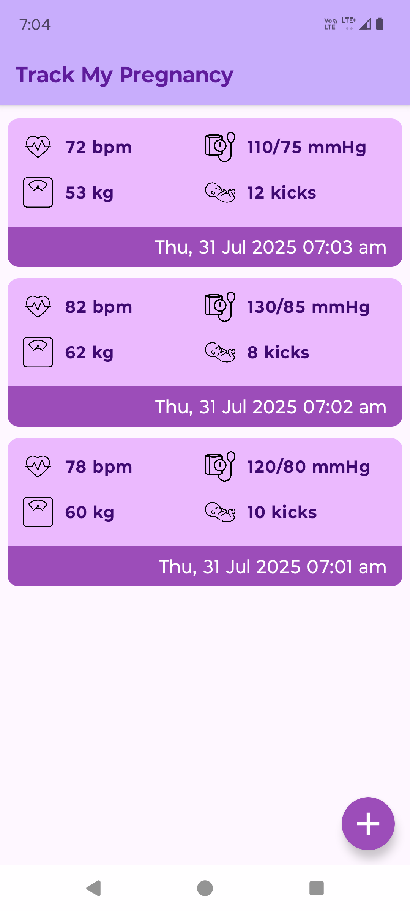
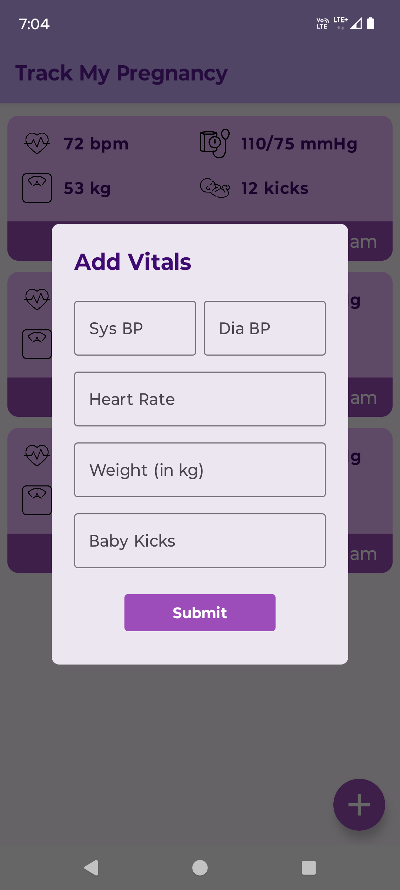
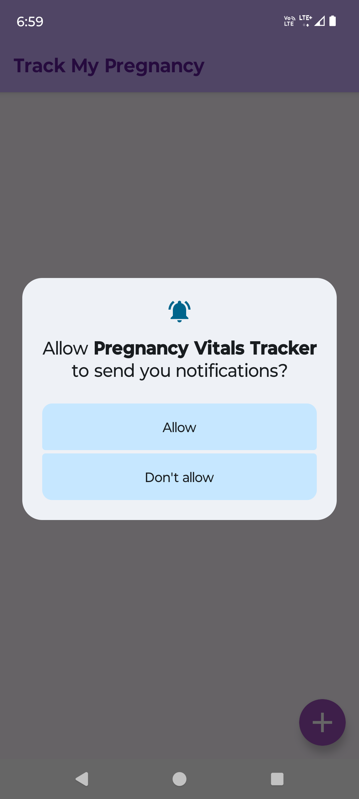

# 🤰 Pregnancy Vitals Tracker

An Android application built using **Kotlin**, **Jetpack Compose**, and **WorkManager**, designed to help pregnant women monitor vital signs such as blood pressure, heart rate, weight, and baby kicks. The app provides timely reminders and user-friendly input dialogs with a clean Material 3 UI.

---

## 📱 Screenshots

| Main Screen | Add Vitals Dialog |
|-------------|--------------------|
|  |  |

| Notification | Permission Prompt |
|--------------|-------------------|
|  |  |

---

## ✨ Features

- 📈 Track vitals like:
  - ✅ Systolic & Diastolic Blood Pressure
  - ✅ Heart Rate
  - ✅ Weight
  - ✅ Baby Kicks
- 🔄 Periodic notifications every 5 hours using **WorkManager**
- 💬 Full-width custom **Compose Dialog** for input
- 🧠 Real-time **input validation**
- 🔔 Supports **notification permission prompt** (Android 13+)
- 🌗 Light/Dark mode compatible
- 🚫 Prevents duplicate or empty entries

---

## 🛠️ Tech Stack

| Layer        | Technology                              |
|--------------|------------------------------------------|
| Language     | Kotlin                                   |
| UI           | Jetpack Compose + Material3              |
| Architecture | MVVM + ViewModel + StateFlow             |
| Background   | WorkManager                              |
| Notifications| NotificationManager                      |
| Gradle       | Kotlin DSL (`build.gradle.kts`)          |

---

## 📂 Project Structure

```
📦 com.example.pregnancyvitalstracker
├── data               # Vital.kt model class
├── ui
│   ├── MainActivity   # Scaffold layout with AppBar & FAB
│   └── components     # AddVitalDialog + VitalsList Composables
├── viewmodel          # VitalViewModel using StateFlow
└── worker             # ReminderWorker for notifications
```

---

## 🚀 Getting Started

### 1. Clone the Repository

```bash
git clone https://github.com/jayeshop/Pregnancy-Vitals-Tracker.git
cd Pregnancy-Vitals-Tracker
```

### 2. Open in Android Studio

- Use Android Studio **Koala (2024.1.1)** or newer
- Wait for Gradle sync
- Run on an emulator or physical device (recommended)

---

## ⚙️ Required Permissions

The app requires:

- `POST_NOTIFICATIONS` on Android 13+  
  It requests permission at runtime.
  
For best notification delivery, **ensure battery optimization is turned off** for the app on your device:

> Settings > Battery > App battery usage > Unrestricted

---

## 🔔 How Notifications Work

- A **WorkManager** task runs **every 5 hours** and triggers a notification reminding the user to log their vitals.
- For testing purposes, you can trigger it once manually via:
```kotlin
val request = OneTimeWorkRequestBuilder<ReminderWorker>().build()
WorkManager.getInstance(context).enqueue(request)
```

---

## 🧪 Testing

- Add sample data via the **Floating Action Button**
- Enter valid numbers; validation will prevent incorrect input
- Check notifications after allowing permissions
- Close the app (do not uninstall) — periodic notifications will still work (if battery settings allow)

---

## 📄 License & Credits

This app was built for the **Janitri Android Intern Assignment**  
All code is open for review and demo purposes.

---

## 👤 Author

**Jayesh Umathe**  
📍 Pune, India  
📧 [jayeshumatheju@gmail.com](mailto:jayeshumatheju@gmail.com)  
🔗 [LinkedIn](https://linkedin.com/in/jayesh-umathe)

---
